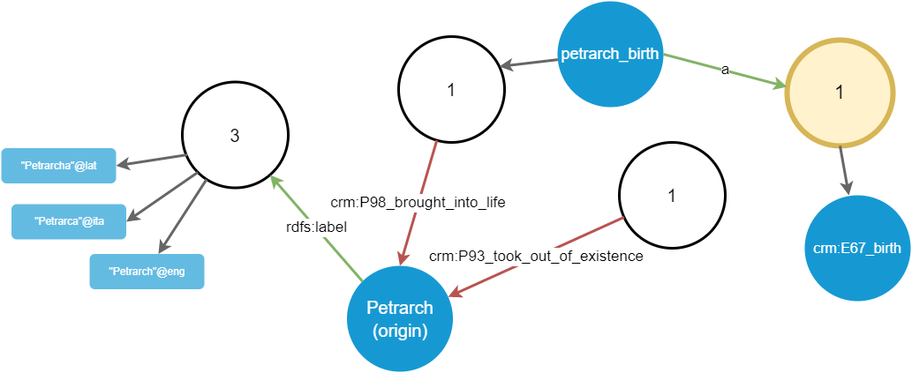

# Walking Graph

- [Walking Graph](#walking-graph)
  - [Example: Step 1](#example-step-1)
  - [Example: Step 2](#example-step-2)
  - [Example: Step 3](#example-step-3)
  - [Example: Step 4](#example-step-4)
  - [Example: Step 5](#example-step-5)
  - [Walker Filters](#walker-filters)
    - [Filtering when Projecting Triple Groups](#filtering-when-projecting-triple-groups)
    - [Filtering when Projecting Nodes](#filtering-when-projecting-nodes)

When editing the graph, it is often useful to explore it starting from a specified node.

The idea is that you start focusing on a single node, e.g. a person; and then you can virtually walk across all its links to other nodes, freely choosing one path after another. So, instead of expanding all the edges and nodes from a single node, which would quickly become messy and confusing, we are letting users pick just want they want to see.

For instance, say you start from the node representing Petrarch; you can see a list of links connected to it. As these might quickly grow, we cannot display all of them at once: it would be both confusing and slow. Rather, we adopt a filtering and paging strategy, consisting of three sets of links:

- "outbound" links: links to nodes, i.e. triples where our chosen origin node is the subject of a triple having a non-literal node as its object.
- "literal" links (always outbound by definition): links to literals, i.e. triples where our chosen origin node is the subject of a triple having a _literal_ node as its object.
- "inbound" links, i.e. triples where our chosen origin node is the _object_. On the other end (the subject end) we will necessarily have a non literal node.

Each of these sets has its filters and paging options, so that users can further refine the visualization by removing unnecessary links and nodes.

To avoid polluting the visualization and provide a visual anchor for filtering and paging, we don't directly represent links on the node; rather, we represent groups of links, each with a number equal to the count of all the links of a specific type.

## Example: Step 1

For instance, say we have these triples connected to the origin node representing Petrarch:

```turtle
x:guys/francesco_petrarca rdfs:label "Petrarca"@ita
x:guys/francesco_petrarca rdfs:label "Petrarch"@eng
x:guys/francesco_petrarca rdfs:label "Petrarcha"@lat

x:events/birth crm:P98_brought_into_life x:guys/francesco_petrarca
x:events/death crm:P93_took_out_of_existence x:guys/francesco_petrarca
```

Of course, in turn these nodes are connected to other nodes in the graph; but at start we limit ourselves to the triples involving our origin node, either as a subject or as an object.

This first step is shown in Figure 1:


*Figure 1 - Walking from origin node*

With relation to the origin node, the first 3 triples are outbound, while the last 2 triples are inbound:

- the outbound triples all share the same predicate (`rdfs:label`), so we just have a single shape out of the origin node, with its count=3. Eventually, we might also want to draw these shapes proportionally to their counts.
- the inbound triples have each one its own predicate; so we have two shapes connected to the origin node, with their count=1.

>Note: getting a page of groups of triples connected to an origin node is done via repository `GetTripleGroups`, which receives the paging, filtering, and sorting parameters, and returns the requested page with triple predicates and their totals.

So, we start with a minimalist visualization, where the origin node is linked to shapes representing groups of triples linked to that node, with their count. The user can now start walking in any direction.

## Example: Step 2

Say that now the user picks the `rdfs:label` shape linked to the origin node. In this case, this expands into 3 literals, representing 3 labels attached to Petrarch in different languages. The result is represented in Figure 2.


*Figure 2 - Walking from the rdfs:label group*

>Note: this is done via repository `GetLinkedNodes` and `GetLinkedLiterals`.

Once we have nodes, the walking process can cyclically resume from them, by focusing on each desired node in turn.

## Example: Step 3

Going on, the user now picks the `crm:P98_brought_into_life` property group, connected to the origin node as an inbound link. It projects a further node, which is the `petrarch_birth` event (Figure 3).


*Figure 3 - Walking from the crm:P98_brought_into_life group*

## Example: Step 4

Again, the user picks the newly added `petrarch_birth` node. This projects another property group, corresponding to predicate `a` (Figure 4).


*Figure 4 - Walking from the petrarch_birth node*

## Example: Step 5

Finally, the user picks this newly added `a` group, which in turn projects a `crm:E67_birth` node, which is the object of the triple. In other terms, this means that the `petrarch_birth` event is classified as a birth event (Figure 5).



*Figure 5 - Walking from the a group of petrarch_birth node*

The example might continue indefinitely, visualizing a graph built by progressive additions, yet compact and readable thanks to paging and filtering. We are thus walking the graph piece by piece, driven only by our choices. This helps users focus on their paths, without being confused by the huge amount of other connections. Each property group shape is the handle used to further refine filtering for its projections, and for navigating across their pages.

So, in the end we just have 3 types of shapes in this graph:

1. shapes representing non-literal nodes (N). These project groups of predicates from an origin node.
2. shapes representing property groups (P), i.e. groups of links sharing the same predicate, and the same node as one of the terms of the triple, either the subject ("outbound links") or the object ("inbound links"). These project nodes from a predicate (in turn connected to another node, being either its subject or its object).
3. shapes representing literals (L). These are terminals and do not project anything.

TODO

## Walker Filters

While walking, the nodes in the graph work also has handles to control paging, filtering, and sorting of triples and nodes.

### Filtering when Projecting Triple Groups

When projecting triple groups from an origin node, the available parameters for filtering triples vary according to the set of triples:

(1a) outbound links to non-literals (`TripleFilter`):

- _subject ID_: equal to the origin node for outbound links.
- _SID_: the triple SID or SID prefix to match for further filtering.
- _tag_: the tag to match for further filtering.
- _predicate IDs_ whitelist and/or blacklist: optional lists of predicates IDs for further filtering.
- _has literal object_: false.
- _sort_: by URI and/or count, ascending or descending, in any valid combination.

(1b) outbound links to literals (`TripleFilter`):

- _subject ID_: as above.
- _SID_: as above.
- _tag_: as above.
- _predicate IDs_ whitelist and/or blacklist: as above.
- _has literal object_: true.
- _sort_: as above.

- _literal pattern_: an optional regular expression pattern to be matched by the literal's value.
- _literal type_: the optional data type of the literal.
- _literal language_: the optional language of the literal.
- _minimum literal number_: the optional minimum numeric value of the literal.
- _maximum literal number_: the optional maximum numeric value of the literal.

(1c) inbound links (by definition there is no literal here; `TripleFilter`):

- _object ID_: equal to the origin node for inbound links.
- _SID_.
- _tag_.
- _predicate IDs_ whitelist and/or blacklist.
- _sort_.

### Filtering when Projecting Nodes

When projecting nodes from a triples group, the available parameters for filtering nodes are:

(2a) outbound group (origin node is subject), non literals (`LinkedNodeFilter`):

- _other node's ID_: this is the subject node ID.
- _predicate ID_: the predicate ID corresponding to the triples group.
- _UID_: the optional portion of the node's UID to match.
- _is class_: optional filter to include/exclude class nodes.
- _tag_: the optional tag to match.
- _label_: the optional portion of label to match.
- _source type_: the optional source type to match.
- _SID_: the optional node SID or SID prefix to match for further filtering.
- _class IDs_: the optional classes IDs to match only those nodes inside any of the listed classes.

(2b) outbound group (origin node is subject), literals (`LinkedLiteralFilter`):

- _subject ID_: the subject ID corresponding to the origin node.
- _predicate ID_: the predicate ID corresponding to the triples group.

- _literal pattern_.
- _literal type_.
- _literal language_.
- _minimum literal number_.
- _maximum literal number_.

(2c) inbound group (origin node is object; no literals involved by definition; `LinkedNodeFilter`):

- _other node's ID_: this is the object node ID.
- _predicate ID_: the predicate ID corresponding to the triples group.
- _UID_.
- _is class_.
- _tag_.
- _label_.
- _source type_.
- _SID_.
- _class IDs_.
