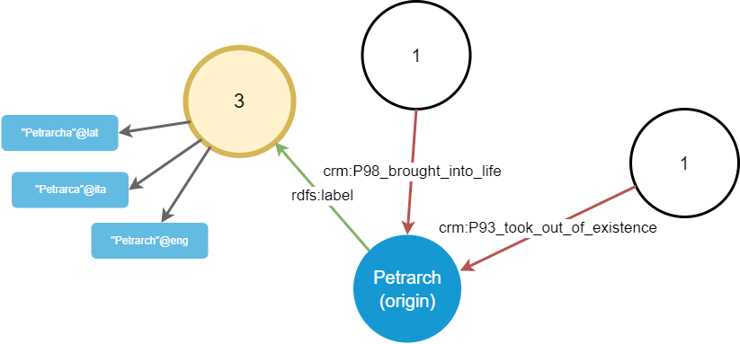
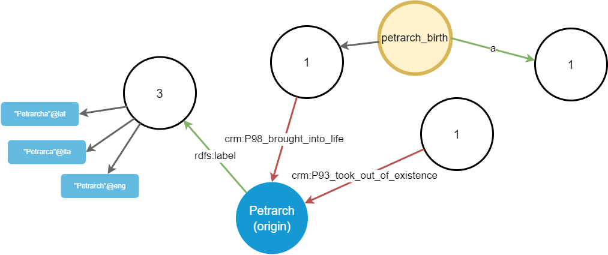

# Walking Graph

When editing the graph, it is often useful to explore it starting from a specified node.

The idea is that you start focusing on a single node, e.g. a person; and then you can virtually walk across all its links to other nodes, freely choosing one path after another. So, instead of expanding all the edges and nodes from a single node, which would quickly become messy and confusing, we are letting users pick just want they want to see.

For instance, say you start from the node representing Petrarch; you can see a list of links connected to it. As these might quickly grow, we cannot display all of them at once: it would be both confusing and slow. Rather, we adopt a filtering and paging strategy, consisting of three sets of links:

- "outbound" links, i.e. triples where our chosen origin node is the _subject_ (and having a non-literal object).
- "literal" links, i.e. triples where our chosen origin node is the subject of a triple having a _literal_ as its object.
- "inbound" links, i.e. triples where our chosen origin node is the _object_.

Each of these sets has its filters and paging options, so that users can further refine the visualization by removing unnecessary links and nodes.

To avoid polluting the visualization and provide a visual anchor for filtering and paging, we don't directly represent links on the node; rather, we represent groups of links, each with a number equal to the count of all the links of a specific type. So, if our origin node is the subject of 3 triples with predicate equal to `rdfs:label` (and a literal object), then a single line labeled `rdfs:label` will start from that node, and end into a shape with 3 as its label. This shape represents the group of all the triples sharing the same subject and predicate, and will be part of the "outbound" links. The same will happen for all the other link sets ("inbound" and "literal").

In our example, the `rdfs:label` shape will be connected to 3 literal values, which will be displayed as nodes linked to that shape. Also, the origin node happens to be the object of 2 other triples: one with predicate `crm:P98_brought_into_life` (whose subject is a birth event), and another with predicate `crm:P93_took_out_of_existence` (whose subject is a death event). This is the first outcome:

So, we start with a minimalist visualization, where the origin node is linked to shapes representing groups of triples linked to that node, with their count. Users can now start walking in any direction: for instance, they might choose to pick the `rdfs:label` shape linked to the origin node. This will expand that shape by connecting it to a paged and eventually further filtered set of nodes.

Once we have nodes, the walking process can cyclically resume from them, by focusing on each desired node in turn. Say we focus on the `rdfs:label` property groups: in this case, this expands into 3 literals, representing 3 labels attached to Petrarch in different languages:

Again, let us now focus on the `crm:P98_brought_into_life` property group, connected to the origin node with an inbound link. It projects a further node, which is the `petrarch_birth` event.

Shifting the focus on it, we get another property group projected, corresponding to predicate `a`:

Again, let us focus on that `a` group: it projects a `crm:E67_birth` node, which is the object of the triple. In other terms, this means that the `petrarch_birth` event is classified as a birth event.

As you can see, we are thus walking the graph piece by piece, driven only by our choices. This helps users focus on their paths, without being confused by the huge amount of other connections. Each property group shape is the handle used to further refine filtering for its projections, and for navigating across their pages.

So, in the end we just have 3 types of shapes in this graph:

1. shapes representing non-literal nodes (N). These project groups of predicates from an origin node.
2. shapes representing property groups (P), i.e. groups of links sharing the same predicate, and the same node as one of the terms of the triple, either the subject ("outbound links") or the object ("inbound links"). These project nodes from a predicate (in turn connected to another node, being either its subject or its object).
3. shapes representing literals (L). These are terminals and do not project anything.
